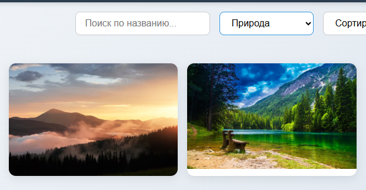
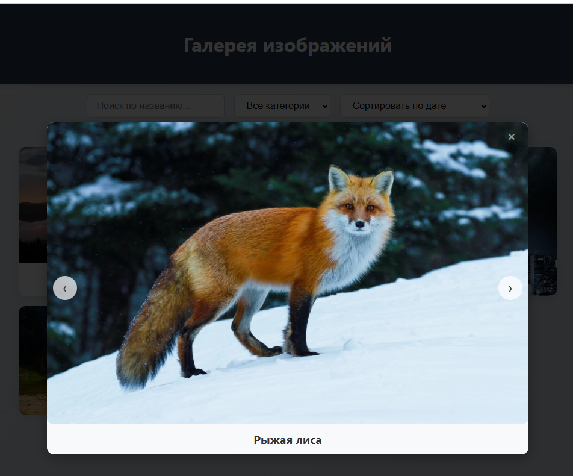
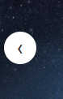

# Галерея изображений

## Описание проекта

Данный проект — это **интерактивная веб-галерея изображений**, реализованная на **чистом JavaScript (Vanilla JS)**. Он демонстрирует практическое применение знаний по:

- работе с DOM,
- обработке событий,
- манипуляции массивами объектов,
- валидации пользовательского ввода,
- модульной архитектуре JavaScript,
- адаптивному дизайну.

Проект **не использует сторонние библиотеки или фреймворки**.

###  Цель:
Подтвердить и закрепить навыки веб-разработки с использованием современного синтаксиса JavaScript (ES6+), HTML и CSS, а также продемонстрировать умение создавать поддерживаемые интерфейсы без фреймворков.

---

###  Зависимости:
Нет. Проект полностью автономен, использует только **HTML, CSS и JS**.

##Структура проекта
```
gallery-project/
│
├── index.html               # Главная HTML-страница
├── css/
│   └── style.css            # Стилизация (адаптивный дизайн, модальные окна)
├── js/
│   ├── app.js               # Основной JS-контроллер
│   ├── gallery.js           # Генерация изображений
│   ├── modal.js             # Модальное окно
│   ├── utils.js             # Сортировка, фильтрация, поиск
│   └── data.js              # Список изображений (массив объектов)
└── assets/
    └── images/              
```
 ## Основной функционал
 
- Отображение изображений в сетке

- Поиск изображений по названию

- Фильтрация по категории (например: природа, животные, города)

 Сортировка по:

 - дате

- названию

 - Модальное окно с полноэкранным просмотром

 - Кнопки навигации (Следующее / Предыдущее)

 - Отзывчивый интерфейс (адаптивный под мобильные устройства)

 ## Примеры использования
 Поиск и фильтрация
При вводе текста или выборе категории галерея обновляется динамически.

 Открытие модального окна
При клике на изображение открывается модальное окно с полноразмерным фото и названием.

 Навигация по изображениям
В модальном окне можно перемещаться между изображениями с помощью кнопок "←" и "→".

 Адаптивность
На экранах смартфонов галерея автоматически перестраивается в один-два столбца, модальное окно подстраивается по высоте и ширине.


## Источники
MDN Web Docs

JavaScript.info

Unsplash API (источник изображений)

## Особенности реализации
 Без использования фреймворков (React, Vue и т.д.)

 Логика разбита на модули по функциональности

 Чистый, хорошо читаемый код с комментариями

 Легко расширяется: можно добавить авторизацию, загрузку изображений и пр.

 Подходит как для портфолио, так и как учебный проект
