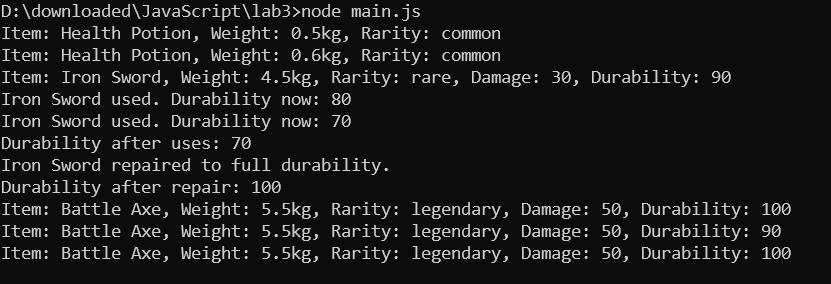

# Лабораторная работа №3: Система инвентаря в JavaScript

## Описание

Консольное приложение моделирует систему инвентаря с использованием классов и функций-конструкторов в языке JavaScript. Реализуются предметы (Item) и оружие (Weapon) с возможностью взаимодействия и изменения свойств.

## Цели

- Изучить классы, конструкторы и наследование в JavaScript.
- Научиться создавать и использовать методы.
- Освоить функции-конструкторы как альтернативу классам.

## Структура

- `Item` — базовый класс для предметов.
- `Weapon` — класс, расширяющий `Item` и добавляющий функциональность оружия.
- Функции-конструкторы `ItemConstructor` и `WeaponConstructor` для повторной реализации без использования синтаксиса классов.

## Пример использования

```js
const sword = new Weapon("Iron Sword", 4.5, "rare", 30, 90);
console.log(sword.getInfo());
sword.use();
sword.repair();
```

## Вывод отработки кода



## Контрольные вопросы
Какое значение имеет this в методах класса?

this ссылается на текущий экземпляр класса.

Как работает модификатор доступа # в JavaScript?

# делает свойство приватным и недоступным за пределами класса.

В чем разница между классами и функциями-конструкторами?

Классы — это синтаксический сахар над прототипной моделью. Функции-конструкторы — более старая форма создания объектов через new и прототипное наследование.
